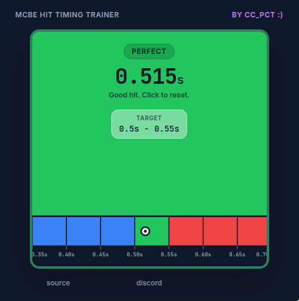

# Mcbe Hit Timing Trainer

Train your hit timing to improve in Bedrock PVP

### How to use
- go to [website](https://ccpct.github.io/MCBE-hit-timing-trainer) (github pages)
- click/ press white square to start
- try to time second click so it land 0.5 - 0.55 sec after first click
- you can see your click timings on the time stamp below
- click to restart

### Why did I make this
- MCBE pvp (hive/ zeqa...) requires good hit reg, which is hitting right after enemy can take damage
- this ensures maximum dps, kb and stops them from comboing you easily
- However the timing is very precise and accurate (0.05 sec window) so it takes practice to master

### notes
- hit sound taken from MCBE vanilla texture pack.
- code originate from my old python project, which i use AI to translate to web and improve appearance/ layout
- no information is collected by the website
